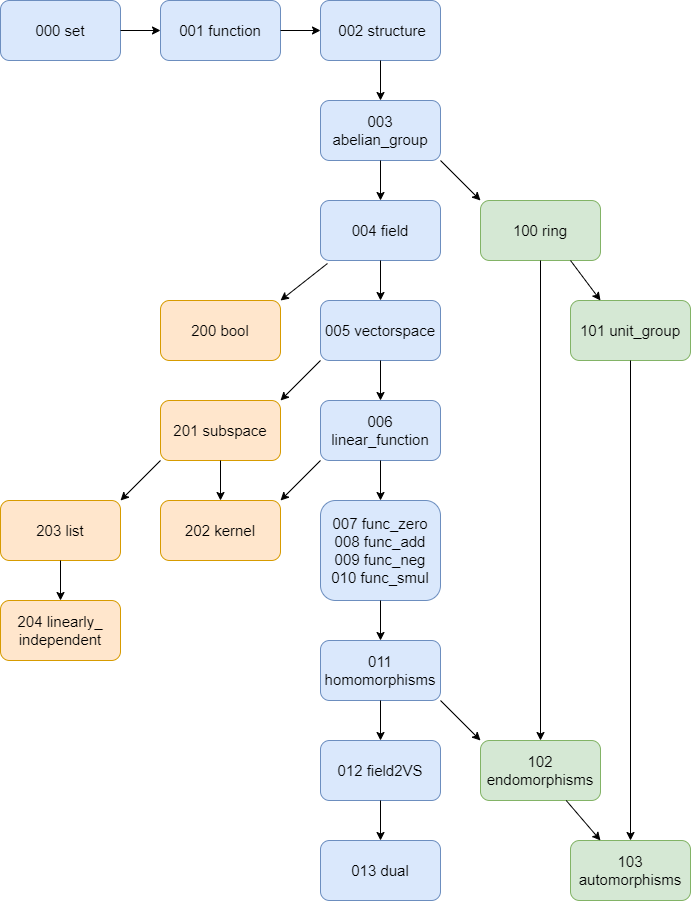
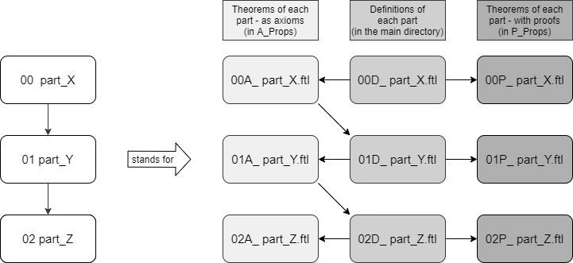

# Linear Algebra in ForTheL

The goal of this project is to formalize some linear algebra in ForTheL.

## Getting Started

### Prerequisites

To run this code install Naproche-SAD and Isabelle.

```
https://github.com/Naproche/Naproche-SAD
```

## Project

### Idea

This project was developed to build a mathematical library for the formalization of linear algebra in ForTheL, a language close to natural language.

It is based on the lean file found under https://github.com/kckennylau/Lean/blob/master/linear_algebra/vector_space.lean.

An updated version of this (working with the current mathlib) can be found in our repository.

The lean file uses the mathlib https://github.com/leanprover-community/mathlib.

### Structure



This graph translates to the actual file readings in the following way:




### Results

The **definitions** of:
- groups, rings, fieldsgroups, rings, fields
- vector spaces, subspaces, dual spaces
- homomorphisms, endomorphisms, automorphisms of vector spaces
- lists, linear independence

And the **proofs** of:
- A field is a vector space over itself.
- The linear maps between K-vector spaces V and W form a vector
space Hom(K,V,W).
- If f is linear, Ker(f) is a subspace.
- If f is linear and Ker(f) = {0}, then f is injective.
- Any K-vector space V can be embedded into the double dual space
(V*)*
- The endomorphisms of a K-vector space V form a ring End(K,V).
- The invertible elements of a ring form a multiplicative group


## Checking Times of the P_ Files
(can depend on which A_ and D_ files have been checked before)
| file name                | checking time (Felix) | checking time (Erik) |
| ------------------------ | --------------------- | -------------------- |
| 000 set                  | 00:00.04 | ? |
| 001 function             | 00:14.73 | ? |
| 002 structure            | 00:03.48 | ? |
| 003 abelian_group        | 00:47.57 | ? |
| 004 field                | 00:48.61 | ? |
| 005 vector_space         | 06:37.78 + 05:13.98 + 05:17.70 + 00:16.41 | ? |
| 006 linear_function      | 00:46.87 | ? |
| 007 func_zero            | 01:20.37 | ? |
| 008 func_add             | 10:51.88 | ? |
| 009 func_neg             | 17:47.46 | ? |
| 010 func_smul            | 03:52.63 | ? |
| 011 homomorphisms        | 02:14.34 | ? |
| 012 field2VS             | ? | 00:31.30 |
| 013 dual                 | ? | 10:14.99 |
| 100 ring                 | 00:06.42 | ? |
| 101 unit_group           | 01:09.01 | ? |
| 102 endomorphisms        | 10:38.45 | ? |
| 103 automorphisms        | 05:50.22 | ? |
| 200 bool                 | 00:14.69 | 1:04.55 |
| 201 subspace             | ? | 16:22.47 |
| 202 kernel               | 01:44.35 | ? |
| 203 list                 | 00:49.94 | ? |
| 204 linearly_independent | 00:28.07 | ? |
