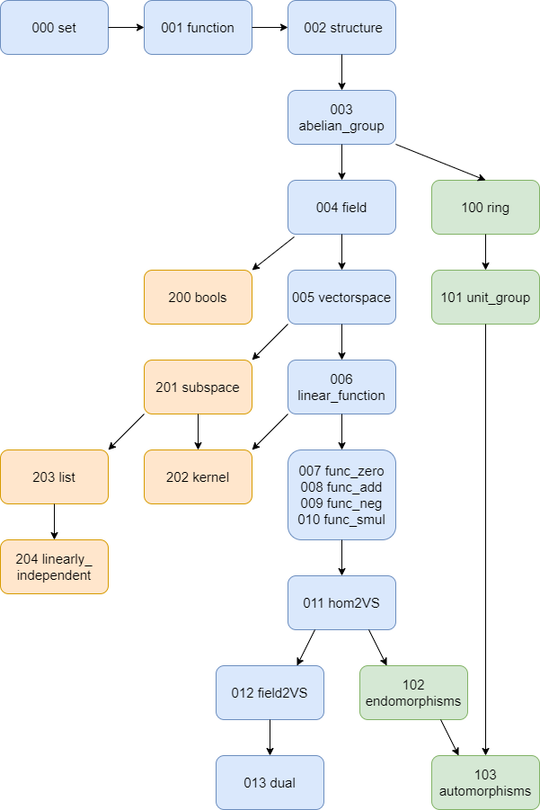

# Vectorspaces in ForTheL

The goal of this project is to formalize vectorspaces in ForTheL.

## Getting Started

### Prerequisites

To run this code install Naproche-SAD and Isabelle.

```
https://github.com/Naproche/Naproche-SAD
```

#


