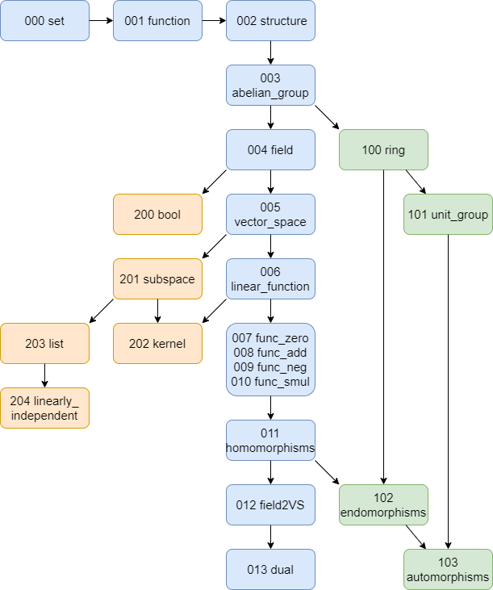

# Linear Algebra in ForTheL

The goal of this project is to formalize some linear algebra in ForTheL.

## Getting Started

### Prerequisites

To run this code install Naproche-SAD and Isabelle.

```
https://github.com/Naproche/Naproche-SAD
```

## Project

### Idea

This project was developed to build a mathematical library for the formalization of linear algebra in ForTheL, a language close to natural language.

It is based on the lean file found under https://github.com/kckennylau/Lean/blob/master/linear_algebra/vector_space.lean.

An updated version of this (working with the current mathlib) can be found in our repository.

The lean file uses the mathlib https://github.com/leanprover-community/mathlib.

### Structure



This graph translates to the actual file readings in the following way:


### Endresults


- Hom(K,V,W) is a vector space.

- A field is a vector space over itself.

- There is an injective function that is linear from a vector space to its double dual space.

- The unit group over a ring is a group.

- End(K,V) is a ring.

- V is a subspace of V.

- Every subspace is a vector space.

- Let f be linear. Ker(f) is a subspace of V.

- Let Ker(f) be {0}. Then f is injective.


## Issues

| file name                | P file last worked | remarks |
| ------------------------ | ------------------ | ------- |
| 000 set                  | 06.03.2020 14:00 (empty) ||
| 001 function             | 06.03.2020 14:25 ||
| 002 structure            | 06.03.2020 14:00 (empty) ||
| 003 abelian_group        | 06.03.2020 14:00 ||
| 004 field                | 06.03.2020 14:00 (empty) ||
| 005 vector_space         | not working  (Translation used 5.95 GB RAM for line 34) | After commenting out the axioms in A_function and the composition stuff in D_function it got to line 52 where I stopped the Reasoner after some time. <br> Couldn't get it to work again yet. <br> It seems that the Translation doesn't do a good job when it comes to ignoring obviously irrelevant preliminaries. |
| 006 linear_function      | 06.03.2020 22:00 ||
| 007 func_zero            | 06.03.2020 19:00 ||
| 008 func_add             | 06.03.2020 19:00 ||
| 009 func_neg             | 06.03.2020 22:00 ||
| 010 func_smul            | not working ||
| 011 homomorphisms        | 06.03.2020 23:00 ||
| 012 field2VS             | 06.03.2020 14:00 ||
| 013 dual                 | 06.03.2020 14:00 ||
| 100 ring                 | 06.03.2020 14:00 (empty) ||
| 101 unit_group           | 06.03.2020 14:00 ||
| 102 endomorphisms        | ? ||
| 103 automorphisms        | ? ||
| 200 bool                 | 06.03.2020 19:00 ||
| 201 subspace             | 07.03.2020 13:50 ||
| 202 kernel               | 07.03.2020 13:50 ||
| 203 list                 | 06.03.2020 19:00 ||
| 204 linearly_independent | 06.03.2020 19:00 (empty) ||
