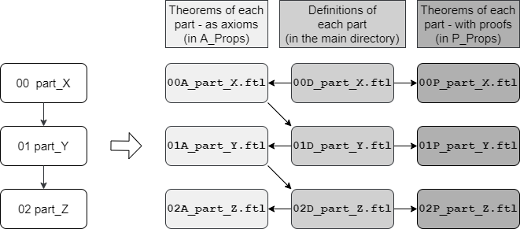

# Linear Algebra in ForTheL

The goal of this project is to formalize some linear algebra in ForTheL.

## Getting Started

### Prerequisites

To run this code install Naproche-SAD and Isabelle.

```
https://github.com/Naproche/Naproche-SAD
```

## Project

### Idea

This project was developed to build a mathematical library for the formalization of linear algebra in ForTheL, a language close to natural language.

It is based on the lean file found under https://github.com/kckennylau/Lean/blob/master/linear_algebra/vector_space.lean.

An updated version of this (working with the current mathlib) can be found in our repository.

The lean file uses the mathlib https://github.com/leanprover-community/mathlib.

### Structure


This graph translates to the actual file readings in the following way:




### Endresults


- Hom(K,V,W) is a vector space.

- A field is a vector space over itself.

- There is an injective function that is linear from a vector space to its double dual space.

- The unit group over a ring is a group.

- End(K,V) is a ring.

- V is a subspace of V.

- Every subspace is a vector space.

- Let f be linear. Ker(f) is a subspace of V.

- Let Ker(f) be {0}. Then f is injective.


## Issues

| file name                | P file last worked       | checking time (Felix) | checking time (Erik) |
| ------------------------ | ------------------------ | --------------------- | -------------------- |
| 000 set                  | 06.03.2020 14:00 (empty) | 00:00.04 | ? |
| 001 function             | 06.03.2020 14:25         | 00:14.73 | ? |
| 002 structure            | 06.03.2020 14:00 (empty) | 00:03.48 | ? |
| 003 abelian_group        | 06.03.2020 14:00         | 00:47.57 | ? |
| 004 field                | 06.03.2020 14:00 (empty) | 00:48.61 | ? |
| 005 vector_space         | 08.03.2020 01:00         | 06:37.78, 05:13.98, 05:17.70, 00:16.41 | ? |
| 006 linear_function      | 06.03.2020 22:00         | 00:46.87 | ? |
| 007 func_zero            | 06.03.2020 19:00         | 01:20.37 | ? |
| 008 func_add             | 06.03.2020 19:00         | 10:51.88 | ? |
| 009 func_neg             | 06.03.2020 22:00         | 17:47.46 | ? |
| 010 func_smul            | 07.03.2020 17:00         | 03:52.63 | ? |
| 011 homomorphisms        | 06.03.2020 23:00         | 02:14.34 | ? |
| 012 field2VS             | 06.03.2020 14:00         | ? | ? |
| 013 dual                 | 06.03.2020 14:00         | 07:09.33 | ? |
| 100 ring                 | 06.03.2020 14:00 (empty) | 00:06.42 | ? |
| 101 unit_group           | 06.03.2020 14:00         | 01:09.01 | ? |
| 102 endomorphisms        | 07.03.2020 15:00         | 10:38.45 | ? |
| 103 automorphisms        | 07.03.2020 15:00         | 05:50.22 | ? |
| 200 bool                 | 06.03.2020 19:00         | 00:14.69 | ? |
| 201 subspace             | 07.03.2020 13:50         | ? | 16:22.47 |
| 202 kernel               | 07.03.2020 13:50         | 01:44.35 | ? |
| 203 list                 | 06.03.2020 19:00         | 00:49.94 | ? |
| 204 linearly_independent | 06.03.2020 19:00 (empty) | 00:28.07 | ? |
